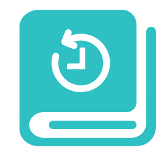

<div align="center">
  
  <h1>ReadItLater</h1>
  <p>简洁高效的稍后阅读 Chrome 扩展 | 右键添加 · 拖拽排序 · 分类管理</p>
</div>

## ✨ 核心功能
- 🖱️ 右键快捷添加/移除网页链接
- ⌨️ 快捷键添加（默认 `Alt+S`，添加到默认分类）
- 🧩 简洁的管理界面
- 🗂️ 多分类管理（支持自定义分类）
- 🔍 全文搜索（标题/URL）


## 🚀 安装使用
```bash
# 安装依赖
npm install

# 开发模式
npm run start

# 构建生产版本
npm run build
```

1. 打开 Chrome 浏览器 → 进入 `chrome://extensions/`
2. 启用「开发者模式」
3. 点击「加载已解压的扩展程序」→ 选择项目 `build` 目录


## 📅 TODO
- [ ] 阅读进度追踪功能（通过Content.js`注入）
- [ ] 自动同步存储（想白嫖Redis cloud的额度，但尝试了却发现当前项目不支持Node.js？）
- [ ] 回收站功能（保留前100条记录）
- [ ] 分类归档功能（已归档的分类将不再popup中显示）


## 🏞️ 截图


  