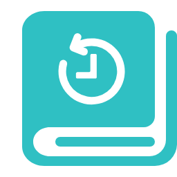

<div align="center">
  
  <h1>ReadItLater</h1>
  <p>简洁高效的稍后阅读 Chrome 扩展 | 右键添加 · 拖拽排序 · 分类管理</p>
</div>

## 功能
- 右键菜单快速添加或移除当前页面/链接
- 快捷键添加当前页面，默认 `Alt+S`
- Popup 中搜索、拖拽排序、分类切换
- Options 页中批量删除、批量移动、分类管理
- 云同步支持（Cloudflare KV）
- 回收站功能（删除的条目可恢复）
- 分类归档管理

## 技术栈
- Chrome Extension Manifest V3
- React 18
- TypeScript
- Webpack 5
- @djchan/kv-sync（云同步 SDK）
- RemixIcon（图标库）

## 项目结构
```text
src/
  pages/
    Background/   后台 service worker
    Popup/        扩展弹窗
    Options/      设置与管理页
  utils/
    readLater.ts  阅读列表共享数据逻辑
    storage.ts    storage key 与基础存取封装
    typing.ts     公共类型
```

## 数据模型
核心数据为 `ReadingItem`：

```ts
interface ReadingItem {
  url: string
  title: string
  addedAt: string
  category: string
  position?: ReadingPosition
}

interface ReadingPosition {
  url: string
  position: number
}

interface Category {
  name: string
  isArchived: boolean
}
```

本地存储使用 `chrome.storage.local`，当前维护以下键：
- `readLaterLinks`
- `readLaterCategories`
- `lastSelectedCategory`
- `readLaterTrash`

## 权限说明
- `storage`：保存阅读列表和分类
- `contextMenus`：右键菜单添加/移除
- `tabs`：读取当前标签页信息
- `activeTab`：操作当前活动标签页
- `scripting`：向页面执行轻量脚本检测
- `commands`：支持快捷键添加

## 云同步
项目支持云同步功能，基于 Cloudflare KV 存储：

- 使用 [@djchan/kv-sync](https://www.npmjs.com/package/@djchan/kv-sync) SDK 实现
- 支持 push（推送到云端）和 pull（从云端拉取）两种同步方式
- 自动合并冲突：基于 `updatedAt` 时间戳判断，保留最新数据
- 需要配置云端服务地址和 API 密钥

详细实现见 `src/utils/syncService.ts`

## 开发
```bash
npm install
npm run start
```

Chrome 加载方式：
1. 打开 `chrome://extensions/`
2. 启用开发者模式
3. 选择“加载已解压的扩展程序”
4. 指向项目的 `build` 目录

## 工程命令
```bash
npm run build
npm run lint
npm run typecheck
npm run test
npm run format
```

说明：
- `build` 会输出 `build/`，并额外在 `zip/` 生成发布压缩包
- `lint` 检查 `src` 与 `utils` 目录
- `typecheck` 运行 TypeScript 静态检查
- `test` 运行 vitest 单元测试


## 🏞️ 截图


